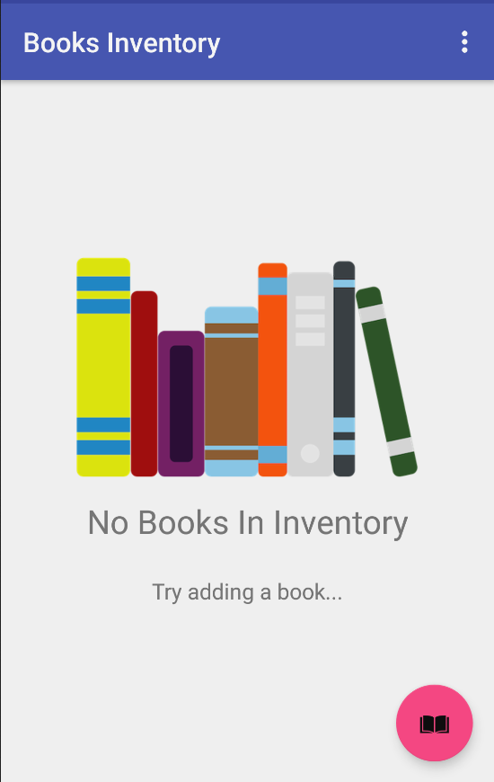
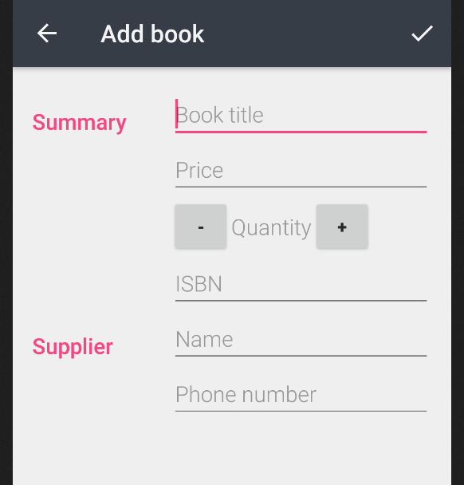

# Store Inventory App

This app allows a book store to keep track of its inventory of products. In the first phase of this project, the app stores dummy information about the a book and allows the user to see information about these dummy data entries in the app. In the second phase, this app will allow the user to track sales and shipments and make it easy for the user to order more books from the listed supplier.

# About the app
 
- Built and tested on Nexus 5 API 25
- App has a main screen where all books in inventory are listed. 
- Each item in the list displays the title of the book, the price of the book, quantity available, and also a book to sale 1 book. ListView and adaptor are used to accomplish this.
- Clicking on a ListView item opens an Editor Activity where the book's data can be updated.
- A floating button is used to allow user to open Editor Activity and add a new book to the database.
- Validation of data occurs and Toasts are used to indicate when a data item is incorrect.
- An intent is used to make a phone call to re-order a book, when in the editing Editor's Activity.

 # Views

 

 

 

 

